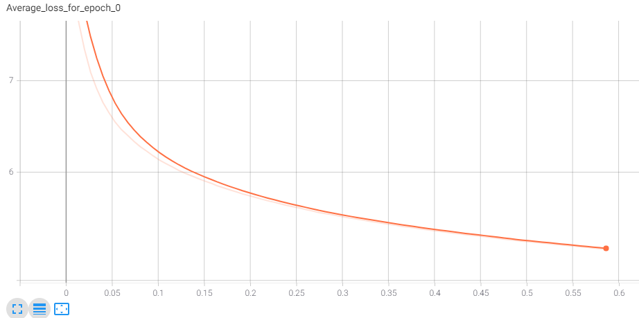

## 智能营销、文本生成项目说明
###  Files
####  data/
    data_utils.py: Helper functions or classes used in data processing.
    process.py: Process a raw dataset into a sample file.  
    back_translate.pyғTranslate a raw dataset into English and back to Chinese.
    embed_replace.py: Replace low tfidf-scored tokens with another token that is similar in the embedding space.  
    semi-supervise.py: Use semi-supervised learning to generate new source from existing reference.
###### data/output
    Place new data generated by data augmentation.
    (replaced.txt, back_translated.txt, and semi_beam.txt...)
##### data/saved
     Put tfidf files here.
     (tfidf.dict, tfidf.model...)
##### data/word_vectors
     Put the word-vector file merge_sgns_bigram_char300.txt  here 

#### model/
    config.py: Define configuration parameters.
    dataset.py: Define the format of samples used in the model.  
    evaluate.py: Evaluate the loss in the dev set.  
    model.py: Define the model.
    predict.py: Generate a summary.  
    rouge_eval.py: Evaluate the model with ROUGE score.
    train.py: Train the model.  
    utils.py: Helper functions or classes used for the model.  
    vocal.py: Define the vocabulary object.

#### saved_model/
    save model that has been trained

#### files/
     Place original data files, augmented data from data/output  here for training. Rouge file is also placed here.  
     (HIT_stop_words.txt, train.txt, dev.txt, test.txt, rouge_result.txt, big_samples.txt...)
 #### runs/
    Save logs here for TensorboardX.

### 项目数据说明
    文本生成任务中，我们作为输入的原文称之为 source，待生成的目标文本 称之为 target ，用来作为 target 好坏的参考文本称之为 reference。
    在本项目的数据源来自于某电商的发现好货栏目，source 主 要由三部分构成：1 是商品的标题，2 是商品的参数，3 是商品宣传图片里 提取出来的宣传文案。
    reference 则是实际该商品的营销文案；

###  数据增强
    1.单词替换；
    2.回译；
    3.自助式样本生成。
####    1.单词替换   
    i.通过替换reference中的词以生成新的reference样本，这里存在一个问题，如果我们替换了样本中的核心词汇，
    比如将文案中体现关键卖点的词汇替换掉了，可能会导致核心语义丢失。所以项目中首先根据tfidf权重对文案中的词汇进行排序，
    然后替换掉排序靠后的词。
    ii.替换单词，项目中的做法是在embedding的词向量空间中寻找语义最为接近的词进行替换。
    iii.TFIDF的计算和相似词向量的查找可以通过gensim来实现。
    [中文词向量下载链接](https://github.com/Embedding/Chinese-Word-Vectors)

####    2.回译
    i.利用百度translate API接口，将source、reference翻译成英语，再由英语翻译成汉语，形成新样本。
    ii.接口具体使用请参见官网：https://api.fanyi.baidu.com/

####    3.自助式样本生成
    类似于半监督学习，步骤如下：
    i.将reference输入到已经训练好的模型中进行预测；
    ii.将预测结果作为新的source和原来reference组成新样本存入文件。

###  模型结构
    1.Seq2Seq+Attention模型(baseline)；
    2.在baseline基础上，引入PGN(Pointer-Generator Networks) + coverage机制；
    3.引入 "Weight tying"、"Scheduled sampling"优化机制；
    4.进行 Beam Search 优化。
    
 ####    Beam Search 优化
    1.进行length normalization和coverage normalization
    2.实现EOS token normalization，并选择一些禁用词汇。
    
### 模型训练
####    参数设置
    修改model/config.py文件的参数配置

####    训练模式
    通过pointer、coverage、fine_tune、scheduled_sampling、weight_tying等
    参数的设置，选择训练模式。
    if pointer:
    if coverage:
        if fine_tune:
            model_name = 'ft_pgn'
        else:
            model_name = 'cov_pgn'
    elif scheduled_sampling:
        model_name = 'ss_pgn'
    elif weight_tying:
        model_name = 'wt_pgn'
    else:
        if source == 'big_samples':
            model_name = 'pgn_big_samples'
        else:    
            model_name = 'pgn'
    else:
        model_name = 'baseline'

####    模型训练、预测和评估
    终端模式下：
    cd model
    nohup python train.py 2>&1 | tee train.out & 
    python predict.py
    python rouge_eval.py

### example
    source
    瑜伽 服 上衣 女 长袖 运动 T恤 性感 露肩 轻质 薄款 跑步 健身 套头衫 上衣 深紫色 精选 搭配 ， 拇指 洞 细节 ， 产品 介绍 ， 细节 处 的 温暖 设计 ， 产品 信息 ， 型录 ， 时尚 的 后背 反光 印花 ， 洗涤 小贴士 ， 肩部 缕空 设计 ， 适用 场景 ， 面料 ， 专业 的 运动 面料 需 单独 洗涤 ，
    尽量避免 浸泡 洗涤 ， 并 尽快 清洗 ， 建 ， 议 轻柔 手洗 ， 若用 洗衣机 清洗 ， 应先 装入 洗衣袋 中 ， 产品 系列 : 时尚 搭配 ， 秋冬 日常 内 搭 or 运动 外穿 皆 可 ， 舒适 体验 每 项 运动 ， 是否 含胸 垫 : 否 ， 品名 : 休闲 T恤 ， 透气 : ， 适中 ， 不可 漂白 ， 针织 面料 ， 
    加厚 ， 既 时尚 又 能 为 夜 跑 的 你 带来 ， 柔软度 : ， 清爽 快干 的 面料 ， 贴 合身 型 的 剪裁 ， 在 降温 时 带来 温暖 的 安心 感 ， 肩部 缕空 运动 上衣 ， 偶遇 小 性感 的 日常 系列 ， 支撑 度 : ， 衣 长 ， 身高 ， 胸围 ， 有害物质 ， 与 国内 化学 染料 不同 ， 天然染料 存有
    轻微 浮色 现象 ， 介 ， 四向 弹力 ， 满足 运动 的 灵活 需求 ， 加长 的 袖口 配合 拇指 洞 ， 低温 滚筒 烘干 ， 款式 : ， 日常 ， 透气 快干 ， 紧身 ， 体重 ， 强度 ， 安全 ， 柔软 ， 偏软 ， 优良 ， 宽松 ， 高强 ， 弹力 : ， 修身 ， 健身 ， 肩宽 ， 偏硬 ， 中度 ， 轻度 ， 瑜伽 ，
    普通 ， 厚度 : ， 良好 ， 微弹 ， 无弹 ， 88% 涤 訾 12% 氨 訾 ， 体重 : 100袖长 长袖 衣长 其它 适用季节 四季 是否含胸垫 不含胸垫 适用人群 女士 材质 其它 功能 吸湿排汗。

    beam  
    运动 休闲 的 短袖 T恤 ， 采用 优质 的 面料 材质 ， 带来 舒适 的 穿着 体验 ， 同时 具有 良好 的 透气性 ， 即使 在 炎热 的 夏季 也 能 穿 出 清凉 的 感觉 。 后背 的 反光 印花 ， 让 夜间 跑步 更加 安全 。

    reference
    这款 性感 露肩 运动 上衣 ， 轻薄 的 面料 ， 吸湿 排汗 性能 良好 ， 跑步 或 做 瑜伽 ， 让 肢体 更 轻松 有 动力 。 利落 的 线条 贴合 上身 ， 勾勒 出 性感 身材 ， 让 健身运动 充满 时尚 气息 。

### TensorboardX
    终端模式下：
    tensorboard --logdir=./cov_pgn/
    可视化训练过程中的loss下降情况
    
